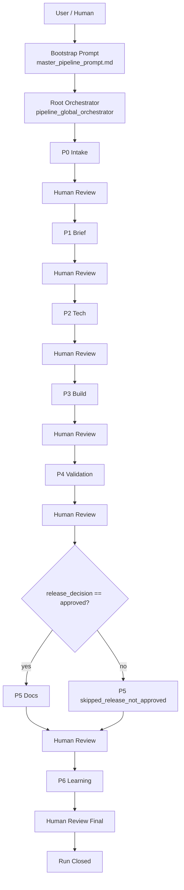

# Guia Completo Do Projeto

## Visao geral

Este projeto implementa uma **factory agent-first** para Devin.
A ideia central e rodar uma pipeline inteira de software usando:

- uma **sessao raiz unica**
- orchestrators por etapa (`P0` a `P6`)
- specialists com **tasks pequenas**
- contratos formais de comunicacao entre coordinator e child sessions
- persistencia em repos internos para tracking, memoria, knowledge e outputs de runtime

O objetivo do projeto e substituir a antiga dependencia de runtime Python por uma arquitetura em que a propria malha de agents faz a coordenacao, o debate interno, a quebra de tarefas, a execucao paralela segura e a consolidacao final.

## O que o projeto faz

Principais capacidades:

1. **Uma sessao raiz controla a pipeline inteira**
   A run comeca em um bootstrap simples e segue pelo root orchestrator.

2. **Pipeline por etapas com gate humano**
   O fluxo canonico e `P0 -> P1 -> P2 -> P3 -> P4 -> P5 -> P6`.
   Cada etapa termina com resumo estruturado e aprovacao humana antes da proxima.

3. **Child sessions com contratos formais**
   Coordinators e specialists trocam dados via envelopes formais:
   - `CoordinatorInput`
   - `SubagentTask`
   - `SubagentResult`
   - `CoordinatorOutput`

4. **Debate interno antes de escalacao**
   Ambiguidades materiais devem ser discutidas entre agents antes de pedir intervencao humana.

5. **DAG de build com paralelismo seguro**
   `P3` controla dependencias reais, `ready_queue`, `max_concurrency` e um `context ledger` entre tasks.
   O objetivo nao e fazer poucas tasks; e quebrar o escopo aprovado em quantas tasks pequenas forem necessarias.

6. **Resume**
   A run pode retomar de uma etapa intermediaria usando estado e artefatos persistidos.

7. **Persistencia completa**
   Tracking, artifacts, state, metrics, memoria, knowledge e promocoes sao gravados em repos internos.

8. **Learning obrigatorio**
   `P6` sempre roda no fim para consolidar memoria, knowledge, skills e promocoes.

## Arquitetura em uma frase

O projeto usa um **coordinator raiz** para controlar a stage machine completa, **stage orchestrators** para controlar cada etapa e **specialists** para executar trabalho pequeno, objetivo e auditavel.

## Entrada canonica

O ponto de entrada canonico e:

- `repos/factory-control-plane/prompts/master_pipeline_prompt.md`

Esse arquivo serve apenas como **bootstrap** da sessao raiz.

A fonte de verdade da execucao e:

- `playbooks/packages/shared/pipeline_global_orchestrator.md`

Em outras palavras:

- `master_pipeline_prompt.md` inicia
- `pipeline_global_orchestrator` governa
- os stage orchestrators executam `P0..P6`
- os specialists executam slices pequenas dentro de cada etapa

## Fluxo funcional da pipeline



## O que cada etapa faz

### P0 - Intake

Responsabilidade:

- transformar o pedido bruto em intake estruturado
- normalizar o prompt
- gerar uma spec inicial forte a partir do intake
- avaliar a spec antes de levar ao review humano
- preparar `stage_review_packet` com `draft_intake_spec` e `promotable_spec_ref`
- deixar o root orchestrator colher aprovacao humana e promover para `approved_intake_spec`
- incorporar melhorias pedidas pelo humano quando o root reabrir `P0` com `changes_requested`
- decidir `route_mode`
- preparar handoff confiavel para a etapa seguinte apos aprovacao da spec

Agents centrais:

- `pipeline_intake_orchestrator`
- `prompt_normalizer`
- `eval_prompt_normalizer`
- `spec_writer`
- `eval_spec_writer`

### P1 - Brief

Responsabilidade:

- transformar a `approved_intake_spec` em briefing executavel
- consolidar requisitos, non-goals, riscos e criterios de aceite
- fechar divergencias de produto por debate e moderacao
- quando `route_mode == pre_briefed`, rodar em modo enxuto para validar, consolidar e fechar lacunas pequenas, sem reabrir discussoes ja aprovadas em `P0`

Agents centrais:

- `pipeline_brief_orchestrator`
- `draft_writer`
- `pm_profile_designer`
- `pm_base`
- `eval_pm`
- `moderator`
- `eval_moderator`

### P2 - Tech

Responsabilidade:

- quebrar backlog tecnico em slices pequenas
- definir arquitetura e build plan
- refinar contratos
- explicitar integracoes
- produzir observabilidade
- sair com Mermaid funcional e tecnico

Agents centrais:

- `pipeline_tech_orchestrator`
- `technical_analyst`
- `eval_tech_analyst`
- `architect`
- `eval_architect`
- `integration_mapper_llm`
- `contract_refiner`
- `observability_designer`
- `eval_observability_designer`

Saidas importantes:

- `build_plan`
- `module_defs`
- `contracts`
- `integration_map`
- `observability_plan`
- `functional_flow_mermaid`
- `technical_design_mermaid`

### P3 - Build

Responsabilidade:

- enumerar task ledger
- controlar DAG e `ready_queue`
- despachar child sessions pequenas
- preservar contexto entre tasks por `context_packet`, `context_updates` e `integration_impacts`
- atuar em repos existentes, lendo convencoes, arquivos vizinhos, `AGENTS.md` e skills antes de alterar
- aplicar debate interno quando houver conflito tecnico
- consolidar artefatos para validacao
- encerrar apenas quando todas as tasks projetadas em `P2` tiverem sido executadas e aceitas

Agents centrais:

- `pipeline_build_orchestrator`
- `builder`
- `code_reviewer`
- `builder_qa`
- `test_builder`
- `eval_test_builder`
- `devops_infra_builder`
- `eval_devops_infra`
- `judge_quorum`

Ownership de testes em `P3`:

- `builder`: codigo de producao
- `builder_qa`: **testes unitarios** do slice
- `test_builder`: testes complementares de integracao/contrato/smoke quando o risco exigir
- `eval_test_builder`: auditoria da camada de testes

Regra de granularidade:

- `P1` e `P2` podem tratar pedidos grandes e complexos.
- `P2` deve decompor esse trabalho em um catalogo completo de slices pequenas.
- `P3` nao reduz escopo para fazer poucas tasks.
- `P3` executa todas as tasks projetadas, respeitando dependencias e paralelizando apenas tasks independentes.
- Se qualquer task projetada ficar pendente, `P3` nao pode retornar `done`.
- Se uma task descobrir impacto em outra, esse impacto deve ser salvo no `context ledger` e usado para recalcular dependencias.

### P4 - Validation

Responsabilidade:

- validar por risco
- consolidar findings
- decidir `release_decision`

Agents centrais:

- `pipeline_validation_orchestrator`
- `dynamic_test_planner`
- validators especializados
- `qa_consolidator`
- `judge_final`

### P5 - Docs

Responsabilidade:

- produzir documentacao final aderente ao sistema entregue
- gerar pacote documental rastreavel

Agents centrais:

- `pipeline_docs_orchestrator`
- `doc_writer`
- `eval_docs`

### P6 - Learning

Responsabilidade:

- consolidar memoria episodica e semantica
- curar knowledge
- decidir promocoes
- atualizar stores institucionais

Agents centrais:

- `pipeline_learning_orchestrator`
- `context_ledger_updater`
- `memory_builder`
- `memory_evaluator`
- `knowledge_curator`
- `promotion_manager`

## Quem coordena o que

### Coordinator raiz

Arquivo:

- `playbooks/packages/shared/pipeline_global_orchestrator.md`

Responsavel por:

- stage machine `P0 -> P1 -> P2 -> P3 -> P4 -> P5 -> P6`
- review humano entre etapas
- child sessions de etapa
- debate interno, quorum e escalacao
- consolidacao final da run

### Coordinator de build

Arquivo:

- `playbooks/packages/build/pipeline_build_orchestrator.md`

Responsavel por:

- task ledger de `P3`
- DAG de modulos
- `ready_queue`
- paralelismo seguro
- controle de dependencias entre tasks pequenas

Importante:

- ele **nao** controla a transicao entre etapas
- ele controla apenas o scheduler interno de `P3`

## Como usar o projeto

### 1) Configurar ambiente

Revise:

- `.env.example`
- `factory_config.json`
- `repos/factory-params/params/repos.json`
- `repos/factory-params/params/repos_fallback.json`

Variaveis importantes de `.env.example`:

- `DEVIN_API_KEY`
- `DEVIN_ORG_ID`
- `DEVIN_MCP_BASE_URL`
- `DEVIN_MCP_TOOL_CALL_ENDPOINT`
- `DEVIN_MCP_AUTH_TOKEN`
- `ARR_URL`
- `FACTORY_GITHUB_REPO_PATH`
- `PLAYBOOK_*_ORCHESTRATOR`

### 2) Garantir que os repos internos estao no lugar certo

O mapeamento canonico de aliases esta em:

- `repos/factory-params/params/repos.json`

Hoje ele espera:

- `repos/factory-control-plane`
- `repos/factory-contracts`
- `repos/factory-params`
- `repos/architecture-reference`
- `repos/refinement-support`
- `repos/factory-memory-knowledge`
- `repos/factory-runtime-data`
- `repos/project-target-repos`

Todos os playbooks em `playbooks/packages` recebem ponteiros explicitos para:

- `DEVIN_SKILL_REGISTRY`: `/workspace/.agents/skills/`
- `FACTORY_SKILL_REGISTRY`: `/workspace/repos/factory-memory-knowledge/skills/skill_registry.json`
- `FACTORY_MEMORY_ROOT`: `/workspace/repos/factory-memory-knowledge/memory/`
- `FACTORY_KNOWLEDGE_ROOT`: `/workspace/repos/factory-memory-knowledge/knowledge/`
- `ARR_REFERENCE_INDEX`: `/workspace/architecture-reference/INDEX.md`
- `ARR_REFERENCE_REPO_FALLBACK_ROOT`: `/workspace/repos/architecture-reference/`

Regra pratica: o agent tenta usar a referencia primaria quando ela existir e, se ela nao estiver disponivel, usa o repo interno/fallback mapeado em `repos/factory-params/params/repos.json`.

Nos schemas, isso aparece assim:

- `CoordinatorInput` pode carregar `skill_registry_file`, `devin_skill_registry_root`, `memory_root`, `knowledge_root`, `architecture_reference_root` e `architecture_reference_fallback_root`.
- `SubagentTask` pode carregar `skill_registry_ref`, `selected_skill_refs`, `memory_refs`, `knowledge_refs` e `architecture_reference_refs`.

### 3) Iniciar uma nova run

Use o bootstrap:

- `repos/factory-control-plane/prompts/master_pipeline_prompt.md`

Fluxo esperado:

1. carregar `factory_config.json`
2. resolver `agent_runtime.root_orchestrator`
3. delegar para `pipeline_global_orchestrator`
4. executar `P0..P6` com reviews humanos entre etapas

### 4) Acompanhar a execucao

Acompanhe principalmente:

- `repos/factory-runtime-data/tracking/execution_tracking.md`
- `repos/factory-runtime-data/tracking/dilemmas_and_solutions.md`
- `repos/factory-runtime-data/tracking/tracking_events.jsonl`
- `repos/factory-runtime-data/state/runtime_state.json`
- `repos/factory-runtime-data/state/workspace_handoff.json`

### 5) Consumir os resultados

Os resultados principais da run devem incluir:

- status por etapa
- `stage_closure_summary` por etapa
- `stage_review_packet` por etapa
- artifact index
- blockers e decisoes
- `release_decision`
- outputs de learning e promocoes de `P6`

## Como configurar no Devin para deixar pronto para uso

Esta secao descreve o setup operacional no Devin para rodar a factory agent-first.
Ela segue o desenho deste projeto e as capacidades atuais documentadas pelo Devin para managed sessions, Knowledge, Skills, Playbooks, AGENTS.md, indexacao e repo setup.

Referencias oficiais uteis:

- [Capacidades avancadas do Devin](https://docs.devin.ai/pt-BR/work-with-devin/advanced-capabilities)
- [Modo Avancado](https://docs.devin.ai/pt-BR/product-guides/advanced-mode)
- [Configuracao de repositorio](https://docs.devin.ai/pt-BR/onboard-devin/new-repo-setup)
- [Indexar um repositorio](https://docs.devin.ai/pt-BR/onboard-devin/index-repo)
- [AGENTS.md](https://docs.devin.ai/pt-BR/onboard-devin/agents-md)
- [Skills](https://docs.devin.ai/pt-BR/product-guides/skills)
- [Criando Playbooks](https://docs.devin.ai/pt-BR/product-guides/creating-playbooks)
- [Knowledge](https://docs.devin.ai/pt-BR/product-guides/knowledge)

### 1) Habilitar capacidades necessarias

No Devin, confirme:

- plano Team ou Enterprise quando for usar Modo Avancado;
- permissao `UseDevinExpert` para quem vai iniciar/operar a factory;
- acesso a managed sessions para orquestracao paralela;
- acesso a Knowledge, Skills e Playbooks;
- acesso ao Devin MCP se voce quiser gerenciar sessoes/playbooks/knowledge programaticamente.

Sem managed sessions, a factory ainda serve como prompt/processo, mas perde a capacidade central de child sessions paralelas.

### 2) Conectar e configurar repositorios

No Devin:

1. conecte o provedor Git em `Settings > Integrations`;
2. adicione o repo desta factory;
3. adicione todos os repos alvo que a factory podera alterar;
4. clone os repos que o Devin deve editar ativamente;
5. configure comandos de manutencao, lint e teste por repo;
6. rode verificacao dos comandos quando possivel.

Repos que devem estar acessiveis:

- repo da factory contendo `factory_config.json`, `playbooks/` e `repos/`;
- repos alvo que serao mapeados em `repos/project-target-repos`;
- repo dedicado de skills, se voce optar por manter skills versionadas fora do repo alvo;
- repos de referencia arquitetural ou documentacao interna, se ficarem fora desta pasta.

### 3) Indexar repositorios

Indexe no Devin:

- o repo da factory;
- os repos alvo;
- repos de referencia importantes;
- repos dedicados de skills, se existirem.

A indexacao ajuda o Devin a recuperar contexto por Ask Devin/DeepWiki e melhora a descoberta de informacoes entre sessoes.
Repo Setup e indexacao sao coisas diferentes: Repo Setup prepara ambiente de desenvolvimento; indexacao melhora busca e compreensao de codigo.

### 4) Criar ou anexar o playbook raiz

Opcao recomendada:

- criar um Playbook no Devin chamado `Factory Root Orchestrator`;
- colar ou anexar o conteudo de `repos/factory-control-plane/prompts/master_pipeline_prompt.md`;
- manter o playbook como bootstrap fino;
- garantir que ele mande carregar `playbooks/packages/shared/pipeline_global_orchestrator.md` como contrato canonico.

Alternativa:

- anexar o arquivo de bootstrap na sessao inicial;
- ou colar manualmente o prompt inicial apontando para o bootstrap.

Nao crie playbooks separados concorrendo com os agents canonicos.
Os playbooks de comportamento dos agents devem continuar versionados em `playbooks/packages`.

### 5) Criar Knowledge minimo da factory

Crie itens de Knowledge no Devin para orientar recuperacao de contexto.
Sugestao de Knowledge inicial:

- titulo: `Devin Factory Agent-First - Fonte Canonica`
- trigger: `Quando a tarefa mencionar factory, pipeline P0-P6, orchestrator, agents, build DAG ou child sessions`
- conteudo:
  - a fonte canonica dos agents e `playbooks/packages`;
  - o bootstrap fica em `repos/factory-control-plane/prompts/master_pipeline_prompt.md`;
  - o root orchestrator fica em `playbooks/packages/shared/pipeline_global_orchestrator.md`;
  - schemas canonicos ficam em `repos/factory-contracts/schemas/envelope`, `pipeline` e `state`;
  - registry canonico de skills fica em `repos/factory-memory-knowledge/skills/skill_registry.json`;
  - nao existe mais `schemas/` na raiz: contratos novos devem nascer apenas em `repos/factory-contracts/schemas/...`.

Use Knowledge para contexto factual e regras recorrentes.
Use Skills para procedimentos executaveis de repos.
Use Playbooks para prompts reutilizaveis de sessao.

### 6) Criar Skills de repos alvo

Em cada repo alvo, crie skills quando houver procedimento repetivel de setup, teste, deploy ou verificacao.
Local recomendado:

```text
.agents/skills/<skill-name>/SKILL.md
```

Exemplos uteis:

- `.agents/skills/test-before-pr/SKILL.md`
- `.agents/skills/run-backend-locally/SKILL.md`
- `.agents/skills/verify-contracts/SKILL.md`
- `.agents/skills/deploy-staging-checklist/SKILL.md`

Cada skill deve ter:

- frontmatter com `name` e `description`;
- passos claros de setup/verificacao;
- comandos de teste/lint/build;
- criterios de sucesso;
- anti-usos ou limites quando houver risco.

Para este projeto, skills de repos alvo sao mais importantes do que copiar todos os playbooks para dentro do Devin UI.

### 6.1) Registrar Skills no registry da factory

Toda skill que um coordinator ou subagent puder escolher deve estar indexada em:

- `repos/factory-memory-knowledge/skills/skill_registry.json`

Esse arquivo nao substitui a skill instalada no Devin.
Ele informa:

- qual skill existe;
- onde a skill real esta (`/workspace/.agents/skills/...` ou skill promovida pela factory);
- quando usar;
- quais etapas/papeis podem usar;
- se a skill esta `active`, `draft`, `deprecated` ou `disabled`.

O root/stage coordinator deve passar para child sessions:

- `skill_registry_ref`: `repos/factory-memory-knowledge/skills/skill_registry.json`;
- `selected_skill_refs`: lista das skills escolhidas para aquela task.

Os builders precisam dessas skills para atuar em repos existentes com menos descoberta repetida.

### 7) Criar `AGENTS.md` nos repos alvo

Em cada repo alvo, coloque um `AGENTS.md` na raiz com:

- comandos de setup;
- comandos de lint/test/build;
- convencoes de codigo;
- estrutura do repo;
- estrategia de branch/PR;
- regras de seguranca;
- caminhos de docs internas relevantes.

Os builders devem ler `AGENTS.md` antes de alterar codigo.
Isso evita que cada child session redescubra convencoes basicas.

### 8) Configurar secrets e acessos

No Devin, configure secrets de forma nativa, nunca no repo:

- tokens de Git/provider;
- tokens de package registry;
- credenciais cloud;
- chaves de API de staging;
- variaveis sensiveis de teste.

Na factory, referencie secrets por nome logico, nao por valor.
Exemplo:

```json
{
  "secret_refs": ["STAGING_API_TOKEN", "NPM_TOKEN"]
}
```

### 9) Configurar os repos no `repos.json`

Atualize:

- `repos/factory-params/params/repos.json`
- `repos/factory-params/params/repos_fallback.json`

Garanta que cada alias exista:

- `control_plane`
- `contracts`
- `params`
- `architecture_reference`
- `refinement_support`
- `memory_knowledge`
- `runtime_data`
- `target_repos`

Em Devin, os caminhos podem ser diferentes do Windows local.
Nos playbooks, use `/workspace/...`.
Na documentacao local, use paths relativos ao repo.

### 10) Instrumentar runtime data

Garanta que existam ou possam ser criadas estas areas:

```text
repos/factory-runtime-data/
|- artifacts/
|- context/
|- metrics/
|- state/
|- tracking/
```

`P3` deve usar especialmente:

- `repos/factory-runtime-data/context/p3_context_ledger.json`
- `repos/factory-runtime-data/tracking/execution_tracking.md`
- `repos/factory-runtime-data/tracking/tracking_events.jsonl`
- `repos/factory-runtime-data/state/runtime_state.json`

O `context ledger` e o ponto que preserva contexto entre builders sem mandar prompts gigantes.

### 11) Configurar schemas no Devin

Nao e necessario cadastrar schema por schema no Devin UI se a sessao conseguir ler o repo.
O importante e:

- o repo da factory estar clonado/indexado;
- os playbooks referenciarem os schemas por path;
- o bootstrap instruir o root a validar envelopes contra `repos/factory-contracts/schemas`.

Schemas canonicos para comunicacao:

- `repos/factory-contracts/schemas/envelope/coordinator_input.schema.json`
- `repos/factory-contracts/schemas/envelope/subagent_task.schema.json`
- `repos/factory-contracts/schemas/envelope/subagent_result.schema.json`
- `repos/factory-contracts/schemas/envelope/coordinator_output.schema.json`

Schemas canonicos para estado:

- `repos/factory-contracts/schemas/state/runtime_state.schema.json`
- `repos/factory-contracts/schemas/state/handoff.schema.json`
- `repos/factory-contracts/schemas/state/tracking_event.schema.json`
- `repos/factory-contracts/schemas/state/promotion_event.schema.json`

Schemas canonicos para contrato de etapa:

- `repos/factory-contracts/schemas/pipeline/stage_contracts.schema.json`

### 12) Rodar smoke test operacional

Antes de usar em trabalho real, rode uma sessao pequena:

```text
Use a Devin Factory neste repo.
Objetivo: executar somente P0 e P1 para uma feature ficticia pequena.
Nao altere repo alvo.
Valide se o root carrega os playbooks, gera spec em P0, pede aprovacao humana e prepara P1.
```

Depois rode um smoke de `P2/P3` com repo alvo pequeno:

```text
Use a Devin Factory para criar uma alteracao pequena em um repo alvo de teste.
Exija P2 com build plan pequeno, P3 com uma task de builder, uma de builder_qa e uma de code_reviewer.
Nao avance para P4 enquanto todas as tasks projetadas nao terminarem.
```

## Boas praticas para o prompt inicial

O projeto foi desenhado para aceitar **um unico prompt inicial** bem estruturado.
Esse prompt nao precisa explicar a pipeline; precisa explicar o **trabalho**.

### O que um bom prompt inicial deve conter

Inclua, quando possivel:

1. **Objetivo principal**
   O que deve ser construido, corrigido ou evoluido.

2. **Escopo**
   O que entra e o que nao entra.

3. **Criterios de aceite**
   Como saber que ficou pronto.

4. **Restricoes**
   Stack, performance, seguranca, custos, integrações, compliance.

5. **Contexto do dominio**
   Para que serve a feature, quem usa, qual fluxo principal.

6. **Preferencias relevantes**
   Ex.: manter compatibilidade, nao mexer em partes estaveis, evitar certas libs.

7. **Artefatos de referencia**
   Paths, schemas, docs, tickets, repos ou arquivos que devem ser lidos.

### O que evitar no prompt inicial

Evite:

- pedir "faz tudo" sem objetivo claro
- misturar varios projetos independentes no mesmo pedido
- mandar tasks gigantes sem criterio de pronto
- omitir restricoes importantes
- usar "ve ai" quando ha criterio objetivo disponivel

### Exemplo de prompt inicial bom

```text
Quero evoluir o sistema X para suportar o fluxo Y.

Objetivo:
- permitir que usuarios criem Z pelo endpoint A e consumam no painel B

Escopo:
- backend do servico principal
- contratos com o consumidor B
- testes unitarios do slice
- documentacao operacional final

Fora de escopo:
- redesign completo da UI
- migracao de banco nao relacionada

Criterios de aceite:
- endpoint responde conforme contrato
- erros invalidos retornam payload padrao
- fluxo principal aparece no painel consumidor
- testes unitarios do slice foram criados

Restricoes:
- manter stack atual
- nao adicionar dependencia externa sem necessidade
- preservar compatibilidade com integracao atual

Referencias:
- ler /workspace/repos/architecture-reference/...
- ler /workspace/repos/project-target-repos/...
- usar contratos em /workspace/repos/factory-contracts/...
```

### Exemplo de prompt inicial ruim

```text
Analisa ai o sistema e melhora tudo.
```

## Pastas do projeto e para que servem

### Raiz do projeto

- `README.md`
  Resumo curto do control plane.

- `GUIA_COMPLETO_DO_PROJETO.md`
  Este guia completo.

- `factory_config.json`
  Config principal de runtime.

- `.env.example`
  Variaveis de ambiente esperadas.

- `playbooks/`
  Fonte canonica dos agents e orchestrators.

- `repos/`
  Repos internos usados pela factory.

Itens removidos da raiz por nao fazerem parte do runtime agent-first:

- `requirements.txt`: dependia do runner Python legado.
- `examples/`: substituido por exemplos canonicos em `repos/factory-control-plane/examples` e `repos/factory-contracts/examples`.
- `schemas/`: substituido por contratos canonicos em `repos/factory-contracts/schemas`.
- `factory_runs/`: substituido por `repos/factory-runtime-data/factory_runs`.

## Repos internos que a factory le e escreve

### Tabela canonica de aliases

| Alias | Pasta esperada | Papel principal | Le | Escreve |
|---|---|---|---|---|
| `control_plane` | `repos/factory-control-plane` | bootstrap, policies, DAG, resume | sim | raramente |
| `contracts` | `repos/factory-contracts` | schemas e contratos de comunicacao | sim | raramente |
| `params` | `repos/factory-params` | repos map, toggles, profiles, fallbacks | sim | raramente |
| `architecture_reference` | `repos/architecture-reference` | guardrails, patterns, referencias de arquitetura | sim | nao |
| `refinement_support` | `repos/refinement-support` | apoio para intake e brief | sim | ocasional |
| `memory_knowledge` | `repos/factory-memory-knowledge` | memoria, knowledge, registry de skills, promotions | sim | sim |
| `runtime_data` | `repos/factory-runtime-data` | tracking, state, metrics, artifacts | sim | sim |
| `target_repos` | `repos/project-target-repos` | repos reais ou templates do projeto-alvo | sim | sim |

### Observacao importante sobre playbooks canonicos

Hoje existe uma unica fonte local para agents/playbooks:

- `playbooks/packages`

Regra atual:

- `playbooks/packages` = **fonte canonica local**
- os playbooks devem ser cadastrados/inseridos no Devin a partir dessa fonte
- o antigo espelho local de playbooks foi removido para evitar divergencia

## Onde cada camada deve estar

Relativo a raiz do workspace:

```text
.
|- playbooks/
|  \- packages/
|- repos/
|  |- factory-control-plane/
|  |- factory-contracts/
|  |- factory-params/
|  |- architecture-reference/
|  |- refinement-support/
|  |- factory-memory-knowledge/
|  |- factory-runtime-data/
|  \- project-target-repos/
|- factory_config.json
\- .env.example
```

## Como fazer referencia a arquivos e pastas

Existem **tres formas principais** de referencia no projeto.

### 1) Alias de repo no `CoordinatorInput`

Exemplo conceitual:

```json
{
  "repos": {
    "control_plane": "repos/factory-control-plane",
    "contracts": "repos/factory-contracts",
    "runtime_data": "repos/factory-runtime-data"
  }
}
```

Use isso quando o coordinator for passar contexto padronizado para stage orchestrators.

### 2) Caminho de workspace dentro dos playbooks

Dentro dos playbooks, o formato esperado e o caminho em `/workspace/...`.

Exemplos:

- `/workspace/repos/factory-contracts/schemas/envelope/coordinator_input.schema.json`
- `/workspace/repos/architecture-reference/INDEX.md`
- `/workspace/repos/factory-runtime-data/tracking/execution_tracking.md`

Use isso quando o agent precisar apontar explicitamente para um arquivo em contexto Devin.

### 3) Caminho relativo no proprio repositorio

Exemplos:

- `repos/factory-control-plane`
- `playbooks/packages/shared/pipeline_global_orchestrator.md`
- `repos/factory-params/params/repos.json`

Use isso em documentacao, configuracao local e referencias humanas dentro do repo.

## Regras de referencia recomendadas

1. Em **configuracao**, prefira caminhos relativos ao repo.
2. Em **playbooks/agents**, prefira `/workspace/...`.
3. Em **coordinator -> child session**, passe alias resolvido + path concreto quando necessario.
4. Em **artifact refs**, prefira gravar o path final persistido em `runtime_data`.
5. Se um alias local nao existir, use `repo_fallbacks_file` ou `repo_fallbacks`.

## Pastas que os agents normalmente leem

### Lidas quase sempre

- `repos/factory-contracts`
- `repos/factory-params`
- `repos/architecture-reference`
- `repos/factory-memory-knowledge`
- `playbooks/packages`

### Lidas dependendo da etapa

- `repos/refinement-support` em `P0/P1`
- `repos/project-target-repos` em `P2/P3/P4/P5`
- `repos/factory-runtime-data` em praticamente todas as etapas

Observacao: `repos/factory-memory-knowledge` e lido por todos como referencia possivel de memoria, knowledge e registry de skills, mas a escrita institucional concentrada continua em `P6` e nos agents de learning/promocao.

## Pastas que os agents normalmente escrevem

### Escrita operacional

- `repos/factory-runtime-data`
  Para:
  - artifacts de run
  - tracking
  - state
  - metrics
  - debate summaries
  - handoffs

### Escrita institucional

- `repos/factory-memory-knowledge`
  Para:
  - memoria episodica
  - memoria semantica
  - knowledge candidates
  - skill events
  - promotion decisions

### Escrita do projeto-alvo

- `repos/project-target-repos`
  Para:
  - codigo
  - testes
  - docs operacionais do sistema-alvo

## Schemas e contratos que sustentam a comunicacao

Arquivos centrais:

- `repos/factory-contracts/schemas/envelope/coordinator_input.schema.json`
- `repos/factory-contracts/schemas/envelope/subagent_task.schema.json`
- `repos/factory-contracts/schemas/envelope/subagent_result.schema.json`
- `repos/factory-contracts/schemas/envelope/coordinator_output.schema.json`

Uso esperado:

- `CoordinatorInput`: root -> stage orchestrator
- `SubagentTask`: stage orchestrator -> specialist
- `SubagentResult`: specialist -> stage orchestrator
- `CoordinatorOutput`: stage orchestrator -> root

### Auditoria de redundancia de schemas

Estado atual:

- `repos/factory-contracts/schemas/` e a fonte canonica nova.
- `repos/factory-contracts/schemas/envelope/`, `pipeline/` e `state/` sao os contratos que os coordinators e agents devem usar em runtime.
- `schemas/` na raiz foi removido.
- a copia arquivada dos contratos Python legados tambem foi removida.

Redundancia eliminada:

- os 43 schemas legados da raiz foram removidos;
- a copia arquivada desses mesmos contratos foi removida;
- a factory agora tem uma unica fonte de contratos: `repos/factory-contracts/schemas`.

Regra operacional:

- novos playbooks nao devem apontar para `schemas/` na raiz;
- novos coordinators nao devem recriar ou usar pastas legadas de contratos Python;
- se um contrato antigo ainda for util como referencia de formato, primeiro promova ou reescreva para `repos/factory-contracts/schemas/envelope`, `pipeline` ou `state`;
- nao recrie pastas legadas para contratos.

Minha recomendacao:

- criar novos schemas somente em `repos/factory-contracts/schemas/...`;
- quando precisar recuperar um formato antigo, use historico de git ou promova o contrato para a estrutura canonica antes de referencia-lo.

## Boas praticas operacionais

1. **Edite a fonte canonica**
   Mude `playbooks/packages`.

2. **Atualize o Devin quando playbooks mudarem**
   Como nao existe mais espelho local, a fonte para cadastrar/atualizar no Devin e `playbooks/packages`.

3. **Quebre tasks sempre**
   Child sessions devem receber trabalho pequeno e objetivo.
   Isso nao significa fazer poucas tasks; significa fazer quantas tasks pequenas forem necessarias.

4. **Nao pule debate**
   Se houver ambiguidade material, faca debate interno antes de pedir ajuda humana.

5. **Nao pule schemas**
   Handoff sem envelope formal vira ambiguidade operacional depois.

6. **Persista antes de handoff**
   Se o artefato nao foi salvo em `runtime_data` ou `memory_knowledge`, o resume fica fraco.

7. **Nao transforme `P2` em texto vago**
   `P2` precisa sair com backlog tecnico, contratos, integracoes e Mermaid.

8. **Nao troque o ownership de testes**
   `builder_qa` e o owner da camada unitaria do slice.

9. **Nao trate `P6` como opcional**
   Learning e parte do fechamento oficial da run.

10. **Nao encerre `P3` com task pendente**
    `P3.done` exige `tasks_projected == tasks_executed_and_accepted` e `pending_tasks_final` vazio.

11. **Preserve contexto entre builders**
    Use `context_packet`, `context_updates`, `integration_impacts` e `context_ledger_ref`.

## Erros comuns

### Erro 1: recriar espelho local de playbooks

Correto:

- usar `playbooks/packages` como fonte canonica local
- cadastrar/inserir os playbooks diretamente no Devin

### Erro 2: mandar task grande para specialist

Errado:

- "implemente todo o sistema"

Correto:

- "implemente o modulo X conforme `MODULE_DEF` Y e `CONTRACT` Z"

### Erro 3: esquecer Mermaid em `P2`

Correto:

- sempre fechar `P2` com fluxo funcional e desenho tecnico coerentes

### Erro 4: achar que `builder` faz todos os testes

Correto:

- `builder` produz codigo
- `builder_qa` produz testes unitarios
- `test_builder` complementa quando o risco exigir
- `eval_test_builder` audita

### Erro 5: escalar cedo para humano

Correto:

- debate interno
- quorum quando aplicavel
- humano em ultimo caso

## Checklist rapido para iniciar uma run

Antes de iniciar:

1. `factory_config.json` esta coerente
2. `.env` foi preenchido
3. `repos/factory-params/params/repos.json` aponta para as pastas certas
4. `playbooks/packages` esta atualizado
5. os playbooks atualizados foram cadastrados/inseridos no Devin quando necessario
6. `architecture-reference` esta acessivel
7. `repos/factory-memory-knowledge/skills/skill_registry.json` esta coerente com as skills disponiveis
8. `project-target-repos` contem o repo-alvo correto

## Checklist rapido para manter o projeto

Ao evoluir a factory:

1. ajuste playbooks canonicos
2. ajuste schemas se o envelope mudou
3. ajuste policies se a regra mudou
4. ajuste params/config se o runtime mudou
5. atualize os playbooks no Devin quando necessario
6. atualize esta documentacao quando a operacao mudar

## Arquivos mais importantes do projeto

- `GUIA_COMPLETO_DO_PROJETO.md`
- `factory_config.json`
- `.env.example`
- `playbooks/packages/shared/pipeline_global_orchestrator.md`
- `playbooks/packages/build/pipeline_build_orchestrator.md`
- `playbooks/packages/technology/pipeline_tech_orchestrator.md`
- `repos/factory-control-plane/prompts/master_pipeline_prompt.md`
- `repos/factory-control-plane/policies/orchestration_policy.md`
- `repos/factory-control-plane/policies/quorum_and_escalation_policy.md`
- `repos/factory-control-plane/docs/SCHEDULER_AND_DAG.md`
- `repos/factory-contracts/schemas/envelope/*.json`
- `repos/factory-contracts/schemas/state/skill_registry.schema.json`
- `repos/factory-params/params/repos.json`
- `repos/factory-params/params/repos_fallback.json`
- `repos/factory-memory-knowledge/memory/`
- `repos/factory-memory-knowledge/knowledge/`
- `repos/factory-memory-knowledge/skills/skill_registry.json`
- `repos/READMEGeral.md`

## Resumo final

Se voce quiser lembrar o projeto em poucas linhas:

- a entrada e um bootstrap simples
- a execucao real e controlada pelo root orchestrator
- cada etapa tem coordinator proprio
- cada specialist recebe task pequena e com schema
- debates internos acontecem antes de escalacao
- `P2` sai com Mermaid funcional e tecnico
- `P3` respeita ownership claro de codigo vs testes, preserva contexto entre builders e so fecha quando todas as tasks projetadas terminam
- `P6` fecha a run com learning obrigatorio
- tudo importante precisa ser persistido nos repos corretos
